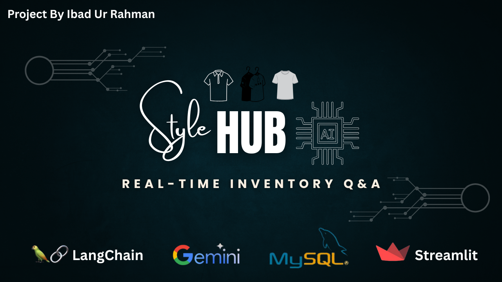
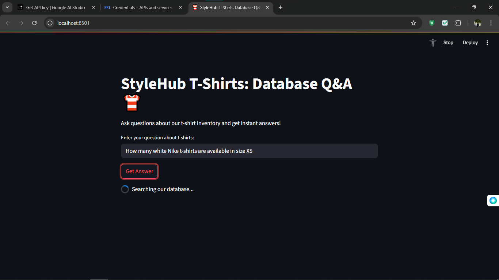
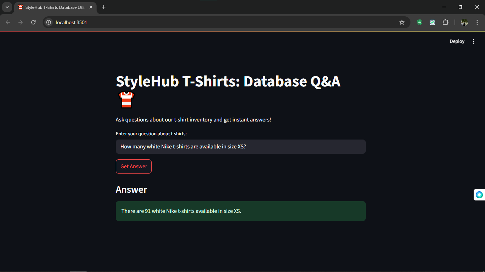
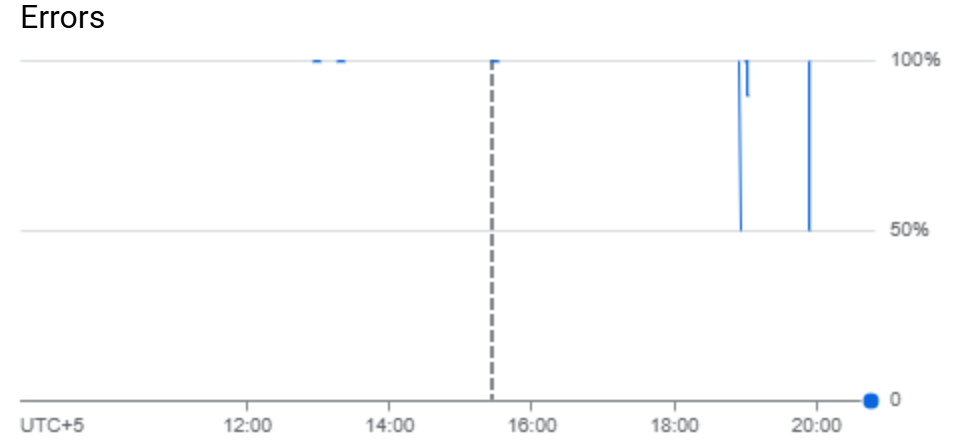
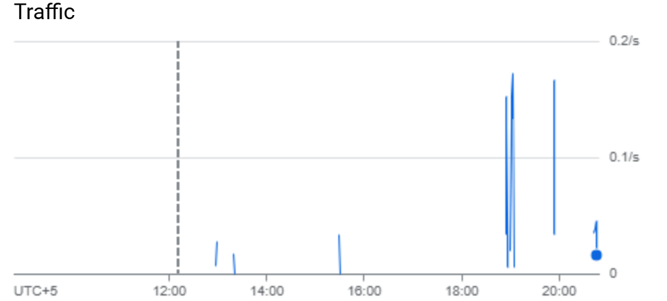
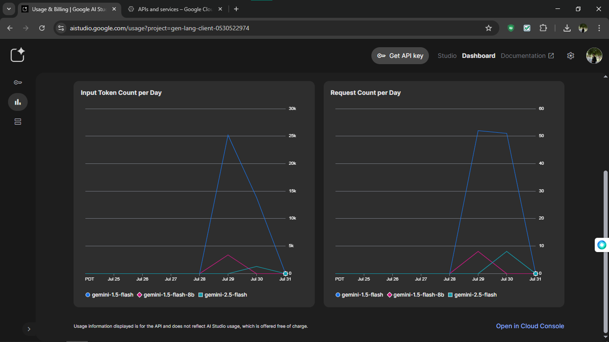

# StyleHub T-Shirts: AI-Powered Inventory Q&A System 👕

<p align="center">
  
</p>


## 🌟 Features
- **Natural Language Processing**: Ask questions in plain English
- **Real-time MySQL Queries**: Get instant inventory insights
- **AI-Powered**: Google Gemini generates accurate SQL
- **Cached Responses**: Faster repeated queries
- **Discount Calculations**: Built-in revenue projections

## 📊 System Overview
.png)

## 🛠️ Tech Stack
| Component          | Technology Used          |
|--------------------|--------------------------|
| Frontend           | Streamlit                |
| AI Engine          | Gemini 2.5 Flash         |
| Database           | MySQL                    |
| Query Optimization | LangChain SQLDatabaseChain|
| Caching            | Python lru_cache         |

## 🚀 Quick Start

### Prerequisites
- Python 3.9+
- MySQL Server 8.0+
- Google API Key ([Get One Here](https://ai.google.dev/))

### Installation
```
# Clone repository
git clone https://github.com/Ibad-Ur-Rahman-Memon/StyleHub-T-Shirts.git
cd StyleHub-T-Shirts

# Install dependencies
pip install -r requirements.txt

# Set up database (MySQL must be running)
mysql -u root -p < setup_database.sql
```
# Running the App

streamlit run main.py <br>
Access the web interface at http://localhost:8501

---
## 📸 Screenshots

| Query Interface | Sample Response | Error Handling |
|-----------------|-----------------|----------------|
|  |  |  |

---
📂 Project Structure
```
StyleHub-T-Shirts/
├── assets/                  # All diagrams and screenshots
├── .env.example             # Environment template
├── main.py                  # Streamlit application
├── db_helper.py             # Database connection logic
├── query_optimizer.py       # Caching implementation
├── requirements.txt         # Python dependencies
├── setup_database.sql       # MySQL schema + sample data
└── tests/                   # Test scripts
```

# 🔍 Example Queries
1. "How many white Nike XS t-shirts?"
2. "Total inventory value for Levi's?"
3. "List all available Adidas colors"
4. "Revenue from discounted Puma shirts"
5. "Average price of medium t-shirts"

---

## 📈 Performance Metrics

| Traffic Analysis | Query Latency | Model Usage |
|------------------|---------------|-------------|
|  |  |  |

---

## 🤝 Contributing

We welcome contributions! Please follow these steps:

1. **Fork** the repository
2. **Create** your feature branch:  
```
   git checkout -b feature/AmazingFeature
```
3. **Commit** your changes:
```
git commit -m 'Add some AmazingFeature'
```
4. **Push** to the branch:
```
git push origin feature/AmazingFeature
```
5. **Open** a Pull Request

For major changes, please open an issue first to discuss your proposed changes.


---
# 📜 License
Distributed under the MIT License. See **LICENSE** for details. <br>

**Copyright © 2024 Ibad Ur Rahman Memon - All Rights Reserved.**
---

## ✉️ Contact

**Ibad Ur Rahman**  
📌 Computer Systems Engineer | SIBAU'26  
📧 [ibadurrahmanmemon.becsef22@iba-suk.edu.pk](mailto:ibadurrahmanmemon.becsef22@iba-suk.edu.pk)  
🔗 [GitHub Profile](https://github.com/Ibad-Ur-Rahman-Memon) | [LinkedIn Profile](https://www.linkedin.com/in/ibad-ur-rahman-memon)  
📍 Sukkur, Pakistan  
